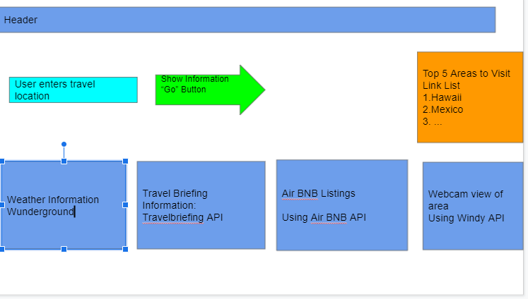
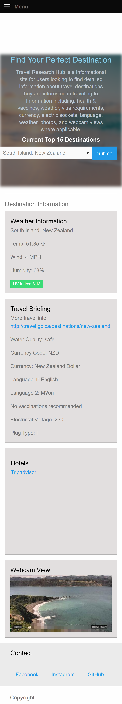
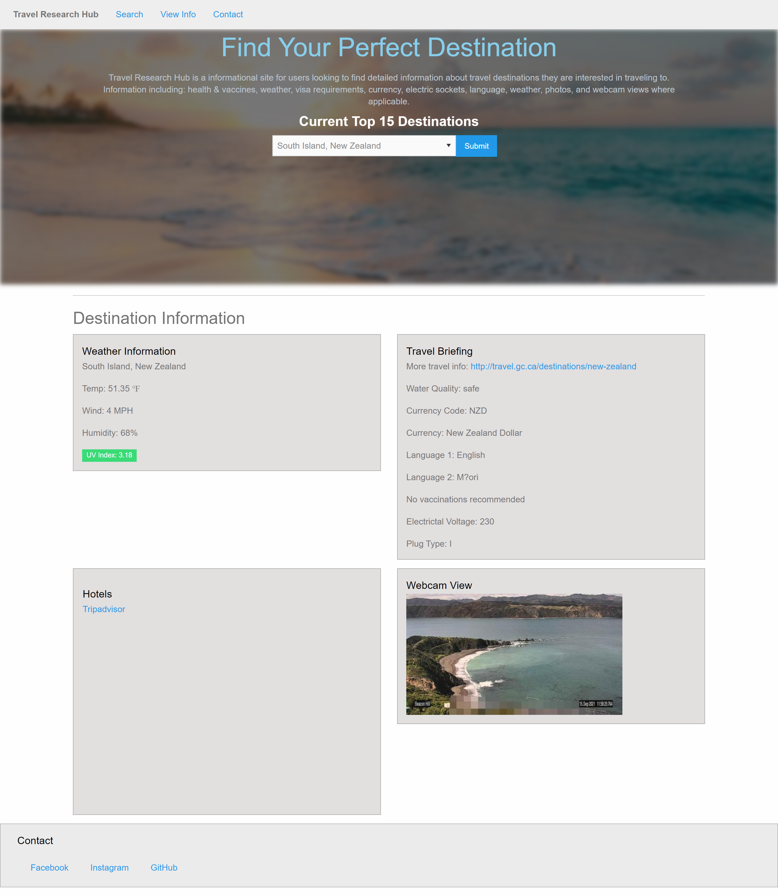

# Travel Research Hub

## Description

Travel information site for users looking to find detailed information about travel destinations they are interested in traveling to. Information including: health & vaccines, weather, visa requirements, currency, electric sockets, language, weather, photos, and webcam views where applicable.

## Link

Here is a link to the deployed application: https://crhodes111.github.io/Project1/

## User Story

```
As A traveler I want to see vacation destination information. 
I WANT up to date travel restrictions,  with weather information for my destination. 
SO THAT I can plan my vacation accordingly.
```
## Layout Concept


## Mobile View


## Web View 


## APIs in use

<a href="https://api.windy.com/webcams/docs#query-parameter ">Webcams</a> <br>
<a href="https://travelbriefing.org/api">Travel Briefing API</a> <br>
<a href="https://developers.google.com/maps/documentation/places/web-service/overview?hl=en">Google Places API</a> <br>
<a href="https://openweathermap.org/api">Weather API</a>


